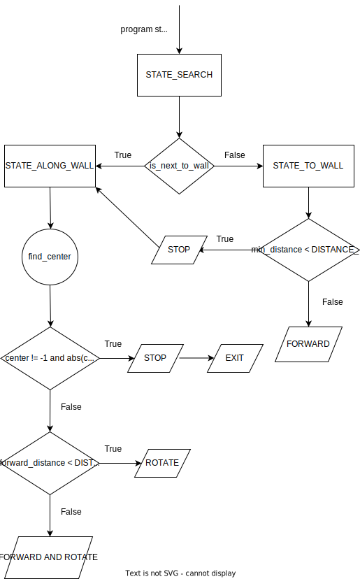

# THD-PLV2 - Turtlebot3 maze challenges (Quirin Wieser)

## Introduction

This report contains documentation of our activities during the university course PLV2 in the winter semester of 2021. The goal was to program a Turtlebot so that it can navigate simple mazes, in real life as well as in a simulation, without driving against the walls. There were five challenges in total and in later challenges the additional task was for the robot to detect red walls and stop when he is near them. In this report, I will first talk about the theoretical part of the course so that the relevant concepts of how we programmed the robot are clear. What is ROS2, what are nodes and what are topics? After that, I will move on to the practical part of the course. Thomas Bergwinkl and I have worked together on programming the robot and I will first off highlight some of the problems we have faced in the individual challenges, in order to show that programming a robot is not as simple as one might think. After that I will go over the relevant concepts of our final code: I will show all the different states the robot can be in and I will explain what each of these states does based on small code fragments from our actual final code, so you can get a deeper understanding of how exactly programming a robot works. Afterwards, I will showcase the different approaches and solutions that we have taken for the individual challenges to attempt to solve the different problems we faced in them. In the end, I will give my personal opinion on how it is to program a robot with ROS2 and what I have learned from this course.

## ROS2 Concepts

ROS stands for "Robot Operating System" and is a set of software libraries and tools for building robot applications. To put it more simply, ROS2 allows you to control the robot and determine how the robot will interact with its environment under certain circumstances. For example, using ROS2 you can get data from sensors that are attached to the robot and with this data, you can then write a python script to program the robot to behave in a specific way for specific data values. To understand how this works you need to understand two important concepts of ROS2: Nodes and Topics. Nodes and Topics work hand in hand and therefore you have to understand both. I will start with ROS2 Nodes: One ROS2 Node is responsible for handling one component of the robot, for example, the sensor. Therefore it is logical to assume that you need multiple Nodes to be able to control any part of the robot. Now, these Nodes can send messages that contain data to other Nodes, allowing the individual parts of the robot to communicate with each other. This works based on the Publisher-Subscriber principle. Nodes that send messages to other nodes are Publishers, Nodes that receive data from other Nodes are called subscribers. A node can also be a subscriber and publisher at the same time. A good analogy is newspaper subscriptions: People subscribe to certain magazines or newspapers to receive them regularly, which makes them subscribers. The newspaper company that is printing them and sending them out is the publisher. Now, these messages the nodes are publishing do not go directly to the respective subscriber nodes. Instead they go to Topics. Topics are responsible for exchanging messages between Nodes and making sure that the right message goes to the right Node. For example: A publisher Node has two Nodes that are subscribed to it. The publisher Node now does not directly send the messages to the two subscriber Nodes, but instead sends it to a Topic which then distributes the message to the two subscriber Nodes. Coming back to the newspaper analogy: The newspaper company does not directly deliver the magazines or newspaper to each individual customer, but instead gives it to a post office, which in this case would be the Topic, and this Post office then distributes the newspapers to all the subscribed customers.

```sh
        self.cmd_vel_pub = self.create_publisher(
                Twist,      # message type
                'cmd_vel',  # topic name
                1)          # history depth

        self.scan_sub = self.create_subscription(
                LaserScan,
                'scan',
                self.scan_callback,  # function to run upon message arrival
                qos_profile_sensor_data)  # allows packet loss

        self.odom_sub = self.create_subscription(
                Odometry,
                'odom',
                self.odom_callback,
                qos_profile_sensor_data)
```

In our case in our code, we publish information to the wheels, which is `cmd_vel_pub`, to be able to move the robot and we subscribe to the laser sensor, and the Odometry data, to get the data we need to tell our robot how to move so that he does not drive into any walls. Each of these Nodes also has a Topic associated with them that handles the exchange of messages regarding this Node. Lastly, the two subcriber Nodes `scan_sub` and `odom_sub` each have a function associated to them that executes each time a message is received by the respective Node. The Node `scan_sub` has the function `scan_callback` associated to it, while the Node `odom_sub` has the function `odom_callback` associated to it.

## Problems

### Challenge 2: Rotation with laser distance sensor data
The first problem we faced was in challenge two. The task was to rotate the robot approximately 90 degrees, using only laser distance sensor data. We quickly realised that the robot was rotating at a different angle with each execution, even though we changed nothing in the code. The robot would either turn more than 90 degrees or would turn not enough. It was rare that the robot turned exactly or near 90 degrees and was very dependent on luck.

### Challenge 4: Robot getting stuck in a divider wall if it sees a part of the red wall around it
The next problem we faced was in challenge four. The task was for the robot to recognize a red wall, drive to it and stop in front of it. The problem was, that when the robot saw part of the red wall around a divider wall, the robot would start driving towards the red wall and then approach the divider wall and stop in front of it, essentially getting stuck.

### Challenge 5: Robot moving too close to the walls in a corner and knocking over the wall when rotating
The next problem we faced was in challenge five, although it is rather a small problem. Sometimes when the robot drove into a specific corner, it would drive too close to the walls, and knock over a wall when rotating. However, this problem was only present in one specific corner and we were not able to reproduce this problem in other corners.

### Challenge 5: Robot not rotating sharp and quick enough when having to drive 180 degrees around a divider wall
The last major problem we faced, was also in challenge five. The task is the same as in challenge 4, but this time the maze was more complex and intricate, with more corners and divider walls to drive around. The problem in this challenge was, that there were several divider walls in the maze, where the robot had to drive around the divider wall and do a 180-degree turn, then keep driving forward. With our initial code, the robot was not able to rotate fast and sharp enough, but would instead drive forward instead of rotating enough and then recognize the wall in front of it and go back the way it came from, essentially being stuck in an endless loop. At other times, the robot would just rotate endlessly after passing a divider wall, instead of driving forward.

### Challenge 5: Robot not driving in a straight line, but swaying left and right
This is not really a problem but more a minor inconvenience. When driving alongside a wall the robot will not drive in a straight line. Instead, it swerves to the left, away from the wall and then back towards the wall over and over again while driving forward. This is due to the robot trying to both maintain a certain distance to the wall, while also being parallel to it.

## Relevant Concepts
The way our code works and the basic concept of it is quite simple. The robot always searches for and drives alongside the right wall, until it reaches a red wall, at which point the robot stops and the program exits. For that, we have defined three states: `STATE_SEARCH`, `STATE_TO_WALL` and `STATE_ALONG_WALL`. Each of these states contains instructions on what the robot should do, depending on what state it is in and each of these states is in the `scan_callback` function, which means that they will be executed over and over again through the `rclpy.spin` function.



### STATE_SEARCH

```sh
        if self.state == STATE_SEARCH:
            if is_next_to_wall:
                self.state = STATE_ALONG_WALL
            else:
                self.state = STATE_TO_WALL
```

This is the state that the robot first starts in when the code is executed. In a nutshell, this state checks if the robot is next to a wall or not. All this state contains is a simple if-else statement that checks if the `is_next_to_wall` variable is `True` or `False`. The `is_next_to_wall` variable shows if there is a wall to the right side of the robot. The way we have defined that is by implementing a function called `next_to_wall` and assigning the `is_next_to_wall` variable to this function. If the variable `is_next_to_wall` is `True` then the robot goes into the state `STATE_ALONG_WALL`, if it is `False` the robot goes into the state `STATE_TO_WALL`.

```sh
def next_to_wall(ranges, degree=45):
    distance = min(ranges[270-degree:270+degree-1])

    if distance < DISTANCE_SAFE:
        return True

    return False
```

This method returns `True` if the robot is close enough near a wall within a 45-degree angle to the right side and `False` if it is not. To make sure that the robot does not collide with any walls, we have defined a variable called `DISTANCE_SAFE` which ensures that the method `next_to_wall` returns `True` soon enough that the robot leaves this state before colliding with a wall.

### STATE_TO_WALL

```sh
        if self.state == STATE_TO_WALL:
            if min_distance < DISTANCE_SAFE * 2:
                self.vel(0, 0)
                self.state = STATE_ALONG_WALL
            else:
                self.vel(SPEED, 0)
```

If the robot is in this state, it means that the robot can not detect a wall at the right side. Similar to the previous state, `STATE_SEARCH`, this state just contains an if-else statement. If the robot is not in front of a wall, it just keeps driving forward. When the robot is a certain distance away from the wall, it stops and goes into the state `STATE_ALONG_WALL`. The `DISTANCE_SAFE * 2` is the maximum distance the robot is allowed to drive to the wall to prevent the robot from colliding with the wall and also giving it enough space to be able to rotate without colliding with a wall.

### STATE_ALONG_WALL

```sh
        if self.state == STATE_ALONG_WALL:
            center = find_center(msg.intensities, 1.5, 2.5)

            if center != -1 and abs(center - 270) < 10:
                self.vel(0, 0)
                exit()
```

If the robot is in this state, it means that it found a wall on the right side and it drove towards it. The first thing the robot does is check if the wall that it is next to is the red wall. This is being done through the `find_center` function, which checks if the robot is near the center of a red wall, based on intensities returned from the scan. If the wall the robot is next to has an intensity of 2, meaning that it is red, and if it is in the center of the red wall, with an error range of +- 10 degrees, the robot stops and the program exits.

```sh
            if forward_distance < DISTANCE_CLOSE:
                self.vel(0, SPEED)
            else:
                self.vel(forward_factor * SPEED, angle_factor * SPEED)
```

If the robot is not next to the red wall, it will just keep driving alongside the wall until it detects a wall in front of it, in which case it will rotate and continue to drive alongside the walls. We have defined the factors `forward_factor` and `angle_factor` so that the robot's speed is dependent on the distance to the walls. This way we avoid the robot driving too fast towards a wall and not being able to rotate in time, when it has to do a 180-degree rotation around a divider wall for example.

## Approaches and Solutions

### Challenge 2: Rotation with laser distance sensor data
Our approach to solving challenge two was to make use of the `sleep()` function and have the robot sleep for a certain amount of time, that we specified by using a calculation to determine how long the robot would take to turn approximately 90 degrees, while it rotates. Once the time we specified was over, the robot would stop rotating and move forward. However, we encountered the problem that the rotation was somewhat random, as mentioned above. After observing a few simulations, we started changing the way we calculate the time, adding factors and using trial and error to determine if we can eliminate, or at least minimize the randomness of the rotation angle. However, despite all this, we could not figure out how to fix the randomness with this approach. So instead of starting over and implementing a different approach, we decided to move on to the next challenge, since it was about using Odometry to rotate the robot, instead of the laser distance sensor, and we figured that this approach would be more accurate and reliable. In hindsight, it was the right choice, as we were correct in that Odometry was a much better method of rotating the robot, and we ended up using Odometry for challenges four and five.

### Challenge 4: Robot getting stuck in a divider wall if it sees a part of the red wall around it
Originally we thought that our first approach would not have this problem, since before starting to write the code for this challenge, we thought about this problem beforehand and realised that it will become an issue if we just program the robot to drive towards the red wall if it sees it. Because of this, we did not program our robot to drive to any part of the wall, but to first off find and then drive towards the centre of the red wall. In order to achieve that, we created the `find_center` function, as explained above in **Relevant Concepts**. Our thought was, that when the robot stops in front of the divider wall, it would automatically slowly correct itself with each spin, based on how much of the red wall is visible to him and then make its way slowly around the divider wall. However, since this was not the case, we tried to change and add some factors to make the robot correct itself faster and at a sharper angle and to make the robot move backwards in a curve so it can better adjust, but after several hours eventually decided to give up on this approach and implement the approach explained in **Relevant Concepts**. With the new approach, this particular problem was solved.

### Challenge 5: Robot moving too close to the walls in a corner and knocking over the wall when rotating
When first observing this problem, we were surprised, since we specifically programmed the robot to stop at a safe distance before a wall, which allows the robot to rotate without colliding with a wall. We were even more surprised to see that the robot could navigate the entire maze, including other corners, without colliding with another wall or corner and that the robot would not always collide with that specific corner, but instead, it was seemingly random. We tried tweaking and changing the distance at which the robot stops in front of a wall before rotating, but it did not change anything. The robot would still sometimes collide with the wall in that specific corner and sometimes he would be able to rotate in that corner without colliding with anything. Since it was seemingly random and only appeared in that one corner and we were clueless as to what caused this, we decided to leave it as it is and ignore that problem, since it was not that big of an issue, as it only appeared in that one corner.

### Challenge 5: Robot not rotating sharp and quick enough when having to drive 180 degrees around a divider wall
With our first approach we noticed that the `is_next_to_wall` variable would be `False` at some point when the robot was driving past the divider wall because after doing a 90-degree rotation and driving past the divider wall, it did not realise that it had to do another 90-degree rotation and drive alongside the divider wall. Instead, it was searching for a new wall and found the wall in front of it, which led to it driving backwards and being stuck in an endless loop. After trying to solve the problem by changing some factors like the speed at which the robot moves, the maximum angle at which it can turn and the distance at which it drives alongside the walls, we came to the conclusion that the robot not only had to maintain a consistent distance to the walls but also that it has to always be parallel to it. We originally thought that by maintaining a constant distance at all times, the robot would automatically correct itself every now and then and be parallel to the walls. It worked for corners and normal walls, but not for divider walls. Once we implemented both the consistent distance and the fact that the robot always tries to move parallel to the walls and after changing some more factors and trying to weigh one of the two conditions more than the other it eventually worked and the robot successfully did a 180-degree rotation while driving around the divider wall, without getting stuck or colliding with it. We also tried this in some 1x1 alcoves in the simulation maze and the robot was successfully able to navigate them.

### Challenge 5: Robot not driving in a straight line, but swaying left and right
We tried fixing this problem last after the code was all finished and the robot had successfully gone through the maze several times. We tried to adjust some factors and weigh one of the two conditions, maintaining distance and being parallel, more than the other but it had no effect. Since we discovered this at the end of the course and this does not cause any issues since the spaces in the maze are more than wide enough for the robot to not collide with anything, we quickly gave up on trying to fix it and were satisfied with our code.

## Results and Takeaways
The final result of our work is a code that allows the robot to navigate pretty much any simple maze and stop when it reaches a red wall, without colliding with any other walls or getting lost or stuck. One of my biggest takeaways was how complex and difficult programming a robot really is. When you have no prior experience with programming a robot, you would think that it is not that hard to tell the robot what to do. In our first on-campus session, I thought that I would just have to implement some if-else conditions to tell the robot what to do in certain situations. However as it turned out, even seemingly simple tasks like just rotating 90-degrees using laser distance sensor data turned out to be quite a problem and proved a lot more difficult than originally thought. Furthermore, the robot's behaviour can be unpredictable when certain values or factors are not correct and we often had the case while trying out our code that the robot did something completely different than what we expected it to do, which cost us a lot of time and nerves. To put it in a nutshell my biggest takeaway was that when working with robots and programming robots you should never underestimate the amount of work, time and knowledge that is required to correctly program the robot. Even if it is a seemingly simple task that you want the robot to accomplish you always have to expect that things are not going to go the way you think and you always have to be flexible and come up with new solutions and approaches on the spot, instead of letting it demotivate you or make you give up because eventually, after a lot of trial and error, you will get the right solution, even if it is not what you thought it would be. Apart from that, this was my first experience with robots and how to program them and I have learned quite a lot about it in a short time span. This first experience and gained knowledge will surely help me in future university courses and Artificial Intelligence projects, both in university and in my future workplace.
