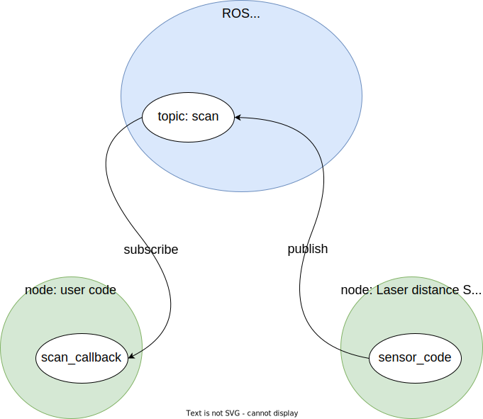

# THD-PLV2 - Turtlebot3 maze challenges (Thomas Bergwinkl)

During the week of the 7th of march in 2022, I mastered the [Turtlebot3 maze challenges](https://mygit.th-deg.de/gaydos/tb3-maze-challenges) together with Quirin Wieser in the curse KI-BI-PLV2 held by [Prof. Gökçe Aydos](https://aydos.de/uni).
This document describes the approaches and pitfalls of getting a [Turtlebot3](https://www.turtlebot.com/), running [ROS - Robot Operating System](https://www.ros.org/), through different mazes with some user code written in Python.
Each challenge covers a new topic, starting from the publish-subscribe pattern used by ROS for the communication of different code modules, sensors and how the data they provide can be used and sending commands to drive the robot.
The later challenges are more tricky and require combining all learned technologies and patterns with state machines.

## Challenge 0 - Subscribe

The first challenge is about retrieving values from the laser distance sensor.
Before this can be done, the publish-subscribe pattern of ROS needs to be understood.
The written program will act as a node that subscribes to the ROS message bus.
Each node acts independently and communicates only over the message bus.
The messages are separated into topics.
A topic can be used to broadcast sensor information or send commands to actuators.
This pattern is used for loose coupling for a modular codebase.
The messages of the laser distance sensor are published to the `scan` topic.
A class for the message type must be given, which will be used to deserialize the message into a Python object.
For the current use case, it's the class `sensor_msgs.msg.LaserScan`.
Last but not least, the piece of code of the node that handles the incoming messages must be defined.
The method `scan_callback` is used, post-fixed with the name of the event-based programming pattern.
The code to subscribe looks like this:

```python
self.create_subscription(
  LaserScan,
  'scan',
  self.scan_callback,
  qos_profile_sensor_data)
```

And the code for the callback method to write the distance to the front looks like this:

```python
def scan_callback(self, msg):
  print('distance front:', msg.ranges[0])
```

Behind the scenes, the laser distance sensor also acts as a node.
It's acting as the counterpart on the `scan` topic.
Whenever the physical sensor throws an interrupt for successfully measuring the distances for a full circle, the data is received from the physical sensor.
Then the software part of the sensor publishes the data in the predefined data structure and topic.



## Challenge 1 - Publish

The second challenge is about driving the robot until it reaches a certain distance to the wall.
This requires publishing messages which will make the wheels of the robot move.
Once the distance is below a given threshold, another message will be published to stop the robot.
Again it's required to know the topic and the message type.
For this use case, the topic is `cmd_vel`, and the message type `geometry_msgs.msg.Twist`.
The publisher instance can be created with the code below:

```python
self.cmd_vel_pub = self.create_publisher(
  Twist,
  'cmd_vel',
  1)
```

Publishing a message is done like this:

```python
self.cmd_vel_pub.publish(cmd_vel_msg)
```

The `Twist` message type requires knowing some hardware-specific limits.
Luckily the `tb3-ros2-template` provides a `vel` method that wraps the code for publishing and abstracts the arguments to linear and angular percentage values.
The method is first called with a linear velocity value greater than 0 to start the robot, and inside the `scan_callback`, it's called again to stop the robot when the given front distance value is reached.

## Challenge 2 - State machine

This challenge requires todo multiple steps after each other.
First, it requires driving forward, as done in the last challenge, and then the robot should rotate.
Initially, the state is `FORWARD` for the first step.
Once the wall is reached, the state is changed to `ROTATE`, and the linear velocity is set to 0 and the angular velocity to a value greater than 0.
With a fixed acceleration and speed, it should be possible to rotate for a specific time to turn the required 90-degrees.
In reality, it didn't work out as well as expected.
Probably some timing differences in the asynchronous code handling caused some issues.
After some tweaking, like reducing the maximum speed, it worked for most causes.
Using the laser distance sensor would have been a better solution. 
The required 90-degree rotation can be detected by evaluating the distance to the right.
The rotation is finished once the value is close to the value measured to the front after the `FORWARD` -> `ROTATE` state change.

## Challenge 3 - New message type

This challenge is the same as the previous one.
It's just required to handle a new type of message from a new topic.
The `odom` topic gives us the position and orientation of the robot.
A conversion is required to make the values of the message type more useful.
The requirements document links to a function that can be used.

## Challenge 4 - First approach

The maze of challenge 4 is U-shaped and would require two 90 degree turns in the most basic version to get from the starting point to the red wall.

We started with a technical description of the goal and a programmatic way to check if the goal was reached.
That allows us to break down all other steps in between.

### Detect the center of the red wall

The goal is to drive the robot in front of the red wall and stop there.
More precisely, we want to reach the point 90 degrees in front of the center of the red wall with a predefined safe distance.  
After some debugging, we knew that the LIDAR sensor could provide us all the required information.
The `intensity` value is `2.0` if the laser hits a red wall.
Since there could be some noise in the signal, a range between `1.5` and `2.5` is used for the detection. 
The `ranges` values can be used to measure the distance.
This information is available for full 360 degrees in 1 degree steps.
If there is a hit to a red wall, the start and end can be found by searching for all consecutive values in both directions.
Some additional logic is required to jump from 360 to 0 degrees if the line crosses 0 degrees.
The center of the line is the center of the red wall.

### Approaching the red wall

Once the red wall is found, the robot can turn towards the center of the red wall and move forward until the `ranges` value for 0 degrees is equal to or smaller than the safe distance.
Until the robot stops, the center of the red wall is continuously recalculated, and the direction is corrected for better results.  

### Find the red wall

Until a red wall is found, the following steps were processed:

1) detect red wall
2) turn 90 degree
3) move forward until the distance to the wall is equals to or smaller than the safe distance
4) goto 1)

Because of the safety gaps we had to add, the robot was lost in an endless loop or lost in a corner.
Some simple recovery strategies were tested with mixed results.
After we had a look at the maze of challenge 5, we decided to switch to a different approach.

## Challenges 4 & 5

The maze of challenge 5 has more turns than in challenge 4.
Simple 90 degree turns would almost all the time end up in endless loops.
Driving along the wall could solve this problem.
No matter how many turns there are, the walls are always connected, and at some point, the red wall will show up.
Before the robot can drive along the wall, it needs to reach the wall.
A state machine is used to handle these steps.

### State machine 


The `STATE_SEARCH` is the initial state when it's unknown whether the robot is already next to a wall or if it needs to drive towards one first.
If the robot is not next to a wall, the state is changed to `STATE_TO_WALL`.
In this state, the robot will drive forward until the LIDAR measures a distance smaller than a configured safe distance.
The distance is measured 360 degrees in case the next wall shows up left or right and not in the front.
Once a wall is found, it switches to state `STATE_ALONG_WALL`.
If that state is reached, no further state changes will happen.
A control loop ensures that the robot stays next to the wall until the red wall is reached.

### Implementation Details

#### Event Handling

All state changes of the state machine are triggered by messages from the LIDAR sensor.
Only the orientation from the odometry is used as an additional parameter.
The orientation is assigned to a member variable to make it accessible in the LIDAR callback.
The state machine handler and the control loop is implemented inside the LIDAR callback.

#### Control Loop

The control loop measures the average distance in a 10 degree window from 270 degrees to the front.
Based on the difference to the target distance, the angular speed is linear adapted to correct the distance.
A 50 degree window to the front is used to detect walls or obstacles.
The linear speed is adapted minimal distance to the front to be able to make more precise movements along corners.
If the distance is below a certain threshold, the linear speed is set to 0.
This logic worked pretty well along straight walls but sometimes led to 360 degree turns in corners.
The robot turned too early, which caused increasing distance measures to the wall.
A second correction factor was added that contains the ratio of the forward distance (260-270 degrees) and the backward distance (270-280).
This factor alone could be used to drive parallel to the wall.
Equally weighted, the combined factor allows the robot to make more stable turns at corners.
For more stability, the angular speed and the linear speed are clamped in a predefined range.

#### Detect being next to the red wall

The same logic that was described earlier to find the center of the red wall is also used for this approach.
As the robot no longer heads directly towards the red wall, the center must be at 270 degrees.
The robot stops if the center is at 270 degrees with a tolerance of +-10 degrees. 

### Problems and possible future improvements

The constants used in the code were chosen by trial and error.
As they affect each other, tweaking them was sometimes complicated and even led to breaking a previously working solution.
A full PID controller may have caused less chaotic behavior on changes to the constants. 

The current implementation of the control loop causes some oscillation.
A PID controller should solve that problem.
